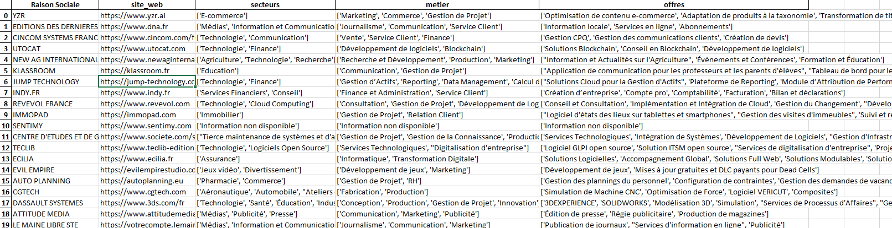

# Background

A simple tool that automates the qualification of a partner(reseller/integrator/editor) by finding its website, industries, business functions and services in a structured way.

* It provides browsing ability to reduce hallucination problem and improve the information precision.

* It provides single mode and batch mode so that you can integrate as an API or in a scheduler easily.

An example of qualification result:

* (industry column) Target your industry
* (job column) The jobs that can be targeted through their industry
* (offers column) The services they offer.



# Install

```bash
pip install partenaire-qualif
```

# Usage
The tool provides browsing ability which can be activated by setting the parameter browsing to True. Sample code below.

```python
from qualif import CompanyQualificationTool
from openai import AzureOpenAI, OpenAI
import pandas as pd


# Necessary Variables
azure_endpoint = "https://..."  # azure openai endpoint
apikey = "..." # azure openai apikey
apiversion = "..." # azure openai api version
model = "..." # azure openai model name

# Setup OpenAI CLI
client = AzureOpenAI(
    azure_endpoint=azure_endpoint,
    api_key=apikey,
    api_version=apiversion,
)

# Use QualificationTool without browsing
browsing = False
tool = CompanyQualificationTool(client=client, model=model, temperature=0, browsing=browsing)
result = tool.qualify(partner_name="Your_Partner_Name")


# Use QualificationTool with browsing
browsing = True
browsing_key = '...' # azure bing search apikey
tool = CompanyQualificationTool(client=client, model=model, temperature=0, browsing=browsing, browsing_key=browsing_key)
result = tool.qualify(partner_name="Your_Partner_Name")
print(result)
```

The tool also allow to execute in batch mode by providing a panda dataframe. Sample code as below.

```python
# Construct panda dataframe from a excel file that has a column containing the name of partners
df_partenaires = pd.read_excel("Partenaires.xlsx",sheet_name="Partenaires")

# Use the batch method to execute the qualification in batch
final_df = tool.batch(df_partners=df_partenaires, col_name_partner="Nom_Partenaire")
final_df.to_excel("Partenaires_qualified.xlsx")
```


# Release
```bash
source release.sh {NEW_VERSION}  # example 1.1.1
```

# Maintainers
[@YMURONG](https://github.com/ymurong)


# License
[](https://opensource.org/licenses/MIT)
